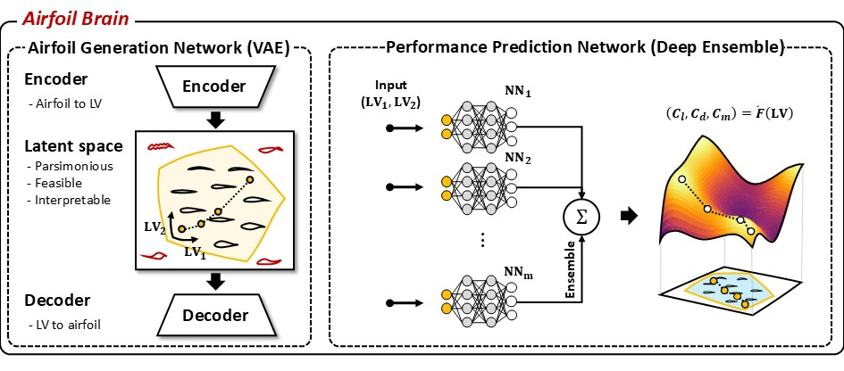
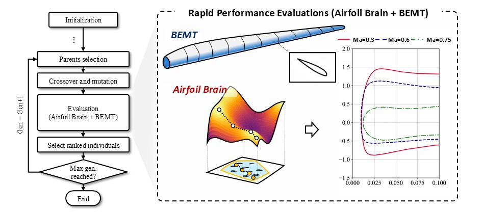

<h1 style="text-align: center; margin-bottom: 70px;">Research Topics</h1>

    <a href="/research_topic1" style="position: relative; margin: 0 40px;">
      
      
Framework Development

    </a>
    <a href="/research_topic2" style="position: relative; margin: 0 40px;">
      
      
Data-driven ROM

    </a>

    <a href="/research_topic3" style="position: relative; margin: 0 40px;">
      
      
ML/AL for Aerodynamic Design

    </a>
    <a href="/research_topic4" style="position: relative; margin: 0 40px;">
      
      
Experimental Data Processing

    </a>

