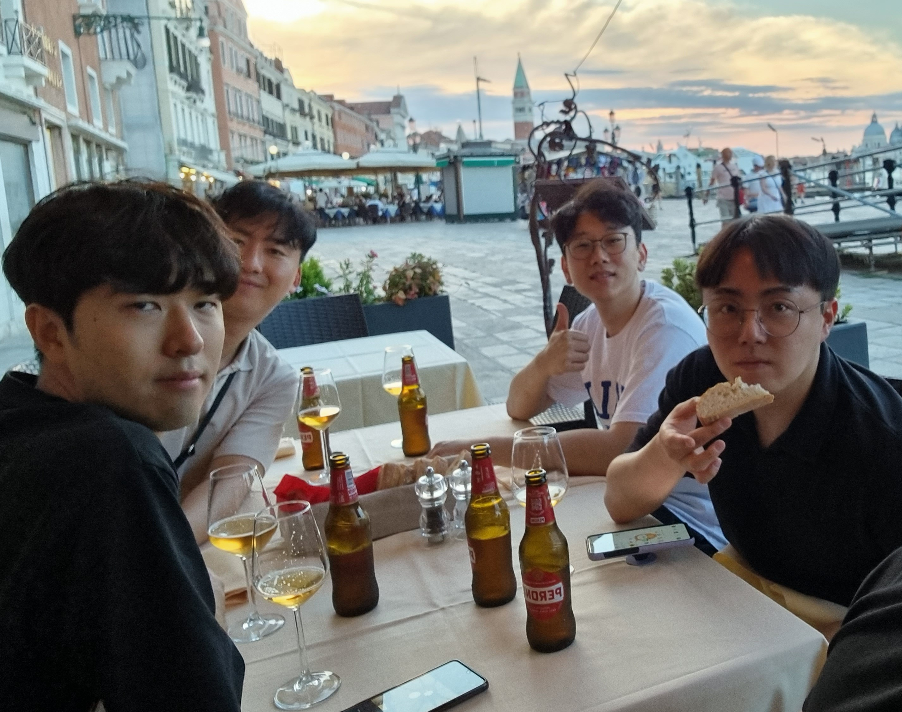

    

        
        

        Yu-Eop Kang
        

    

  

    <h1 style="margin-bottom: 10px;">About Me</h1>
    

      I'm <a href="/Profile" style="color: inherit; text-decoration: underline;">Yu-Eop Kang</a>, Ph.D. Candidate at Seoul National University. My research interest lies in applying ML/AI to address challenges in aerodynamic data processing, with experience spanning both experimental and numerical data. I focus on enhancing the efficiency of traditional systems, particularly in areas such as data processing, aerodynamic modeling, and shape optimization. 
        
      My primary approach involves data-driven reduced-order modeling (ROM), which is essential for the efficient processing and analysis of high-dimensional data. Recently, my research has expanded to include geometric parameterization using generative AI and the development of reliable surrogate models for efficient design optimization.
    

    

<h3>Research highlights:</h3>

  <ul style="list-style-position: inside; line-height: 1.5; padding-left: 0; margin-left: 0;">
    <li style="margin-left: 10px;">Data processing of climatic wind tunnel test data using ML, including image processing and sparse reconstruction.</li>
    <li style="margin-left: 10px;">Development of reduced-order modeling algorithms to improve the accuracy, robustness, and interpretability.</li>
    <li style="margin-left: 10px;">Development of an efficient framework for aerodynamic shape optimisation using generative modelling and surrogate models.</li>
  </ul>

  

