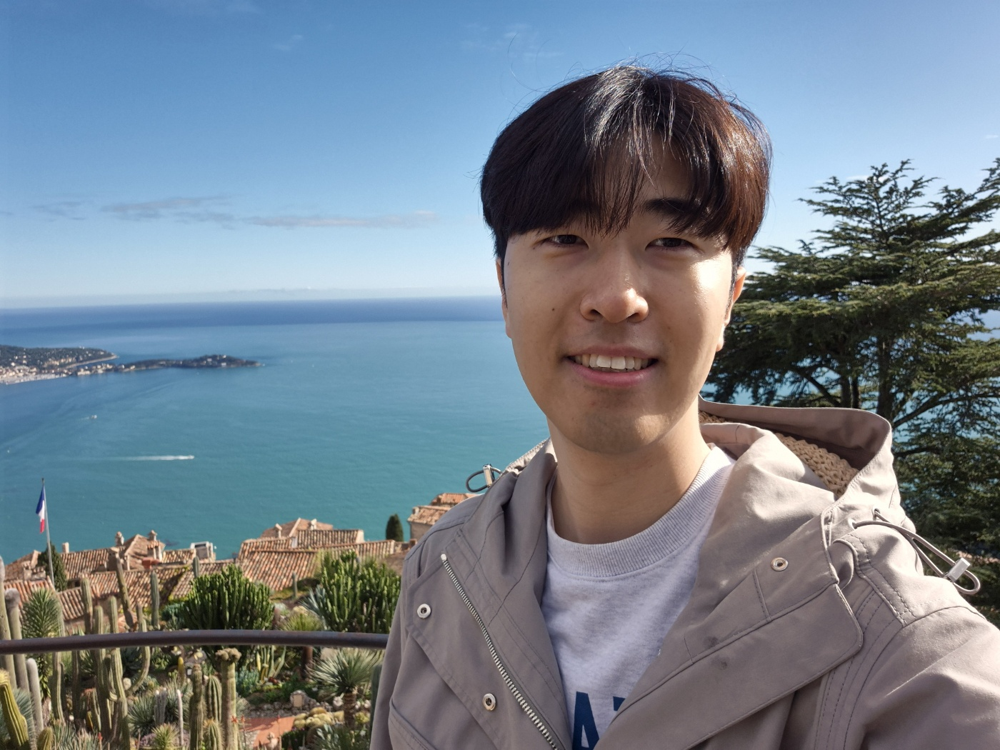

    

        
        

        

    

  

    <h1 style="margin-bottom: 10px;">About Me</h1>
    

      I'm <a href="/Profile" style="color: inherit; text-decoration: underline;">Yu-Eop Kang</a>, a researcher exploring how artificial intelligence can push the boundaries of engineering design by making design workflows more efficient, intuitive, and less labor-intensive. During my Ph.D studies, I focused on reduced-order modeling (ROM) to address the high-dimensionality of aerodynamic design problems. My research spans geometric parameterization using generative AI, the development of reliable and interpretable predictive models, the application of Bayesian optimization, and the processing of experimental data.
        
      Driven by curiosity and a collaborative spirit, I have worked with colleagues across diverse research areas, including rotor blade design, wind tunnel testing, aeroacoustics, and spectral analysis. These interdisciplinary experiences are reflected throughout my <a href="/Publications" style="color: inherit; text-decoration: underline;">publication record</a>. As I complete my Ph.D. in 2025, I am eager to tackle new challenges in broader domains where I can apply this expertise to innovative, real-world problems.
    

    

<h3>Research highlights:</h3>

  <ul style="list-style-position: inside; line-height: 1.5; padding-left: 0; margin-left: 0;">
    <li style="margin-left: 10px;">Development of <a href="/research_topic2" style="color: inherit; text-decoration: underline;">ROM algorithms</a>  to improve the accuracy, robustness, and interpretability.</li>
    <li style="margin-left: 10px;">Development of an <a href="/research_topic1" style="color: inherit; text-decoration: underline;">efficient framework</a> for <a href="/research_topic3" style="color: inherit; text-decoration: underline;">aerodynamic design optimization</a> using generative modelling and surrogate models.</li>
    <li style="margin-left: 10px;"><a href="/research_topic4" style="color: inherit; text-decoration: underline;">Data processing</a> of climatic wind tunnel test data using ML, including image processing and sparse reconstruction.</li>
  </ul>

  

